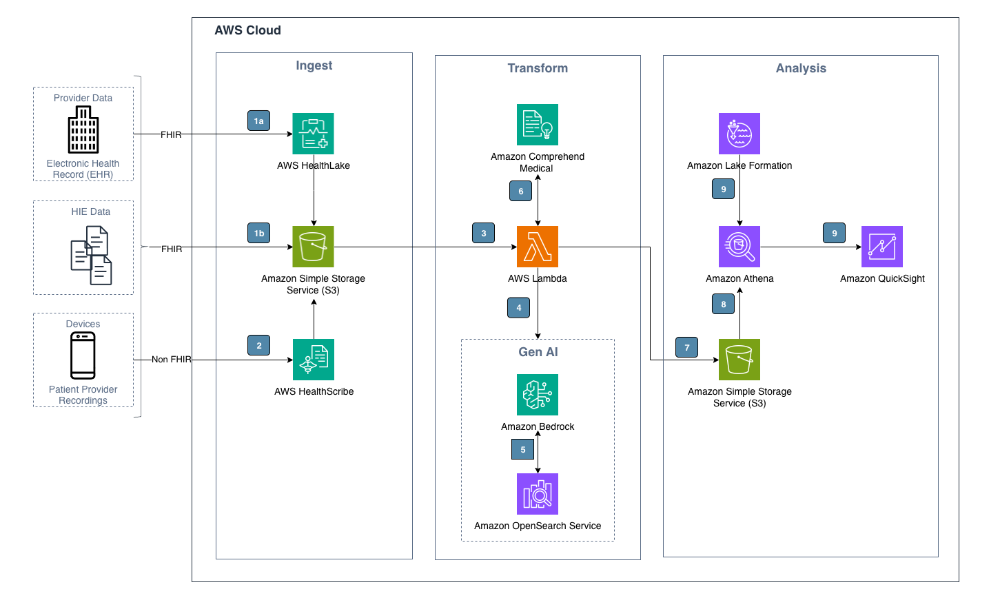

# Guidance for Identifying Diagnosis Codes from Clinical Notes on AWS

Assigning appropriate ICD-10 codes from clinical notes is a crucial task in healthcare documentation, as it involves identifying medical conditions accurately. This process entails a careful review of the patient's medical history, presenting symptoms, physical examination findings, diagnostic test results, and any other relevant information documented in the clinical notes. This solution provides guidance on leveraging AWS services to effectively and accurately identify ICD-10 codes from patients' medical histories, clinical notes, or examination findings.

## Architecture



## Architecture Overview

The pipeline consists of three main stages:

1. Ingest :
   - Amazon S3: Acts as the initial data storage. Raw data is uploaded and stored in an S3 bucket.
2. Transform

   - AWS Lambda: Serves as the central orchestrator for the transformation process. It is triggered when new data is added to the S3 bucket.

   - Amazon Comprehend Medical: Used for extracting medical conditions and ICD-10 codes as the initial reference. Lambda invokes Comprehend to extract insights from the text data.

   - Amazon Bedrock: Provides access to foundation models for generative AI capabilities. Lambda utilizes Bedrock and Anthropic Claude model for identifying medical conditions and ICD-10 codes from the clinical notes. Note that Amazon Comprehend Medical is used to extract initial insights. Then the results from Amazon Comprehend Medical is used by Amazon Bedrock to finalize the ICD-10 code recommendation.

   - Knowledge base for Amazon Bedrock: Used to store organization specfic documentation about nuances on medical conditions and ICD-10 codes. Bedrock Knowldegebase is created using OpenSearch serverless as the Vector DB.

3. Analysis
   - Amazon S3: The processed and analyzed data is stored back into an S3 bucket for further use or archival.

## Data Flow

1. Raw data is uploaded to the ingestion S3 bucket.
2. AWS Lambda function is triggered by the new data in S3.
3. Lambda processes the data and invokes Amazon Comprehend Medical for NLP tasks.
4. Lambda then utilizes Amazon Bedrock for advanced AI processing.
5. Knowledge base for Amazon Bedrock is used to pull organization specific ICD-10 code information to augment the recommendation.
6. The final recommendation is stored as an output in the S3 bucket.

### Services Used

- Amazon Simple Storage Service (S3)
- AWS Lambda
- Amazon Comprehend Medical
- Amazon Bedrock
- Knowledge base for Amazon Bedrock, OpenSearch Service as the Vector DB

## Cost

_You are responsible for the cost of the AWS services used while running this Guidance. As of Apr, 2025, the cost for running this Guidance with the default settings in the US East (N. Virginia) AWS Region is approximately $500 per month._

Assumptions:
- Region = us-east- 1
- Test runs per month = 150
- Average number of characters per patient note  = 10,000


The following table provides a sample cost breakdown for deploying this Guidance with the default parameters in the US East (N. Virginia) Region for one month.

| AWS service  | Dimensions | Cost/Month [USD] |
| ----------- | ------------ | ------------------- |
| Amazon Comprehend Medical | Medical ICD-10-CM Ontology Linking API  | $ 0.25 |
| AWS Lambda | 150 requeste per month, average duration per invocation 10 min | $ 4.50 |
| Amazon SageMaker | 1 notebook instance ml.t3.medium running for 2 hours/day | $ 3.00 |
| Amazon OpenSearch Serverless | Bedrock KB, 1 Indexing OCU, 1 Search and Query OCU, 1 GB data | $ 350.42 |
| Amazon S3 | 1 GB per month S3 standard storage | $ 0.02 |
| Amazon Bedrock | Bedrock invoke model (Anthropic Claude Sonnet 3) , input token = 45,000 and output tokens = 6,000 per call | $ 137.70 |
| **Total Cost** |  | **$ 495.89** |

## Deployment Instructions

Please ensure that model access for Anthropic Claude 3 Haiku, Anthropic Claude 3 Sonnet, Anthropic Claude 3.5 Sonnet, Titan Embeddings G1 - Text, Titan Text Embeddings V2 are setup in Bedrock for your AWS account.

git clone the project in your local dev environment, which is configured to connect to you AWS environment

This is a blank project for CDK development with Python.

The `cdk.json` file tells the CDK Toolkit how to execute your app. Update the following parameters in the `cdk.json` file.

```
    "BucketName": "patients-summary",  // bucket name for input and output data.
    "DefaultRegion": "us-east-1",      // AWS Region
    "AccountId": "",       // AWS Account where this stack is going to be deploy
    "NeedsApi": true,                  // If API deployment needed then true or false
    "NeedsSageMakerDomain": true       // If SageMaker doming creation needed then true or false

```

This project is set up like a standard Python project. The initialization
process also creates a virtualenv within this project, stored under the `.venv`
directory. To create the virtualenv it assumes that there is a `python3`
(or `python` for Windows) executable in your path with access to the `venv`
package. If for any reason the automatic creation of the virtualenv fails,
you can create the virtualenv manually.

To manually create a virtualenv on MacOS and Linux:

```
python3 -m venv .venv
```

After the init process completes and the virtualenv is created, you can use the following
step to activate your virtualenv.

```
source .venv/bin/activate
```

If you are a Windows platform, you would activate the virtualenv like this:

```
% .venv\Scripts\activate.bat
```

Once the virtualenv is activated, you can install the required dependencies.

```
pip install -r requirements.txt
```

Ensure Docker is running in your local env from where you are deploying

At this point you can now synthesize the CloudFormation template for this code.

```
cdk synth
```

To initiate the deployment process, execute the CDK bootstrap command. This will establish the necessary initial roles and resources required for the deployment to proceed.

optionally, you can provide profile information along with cdk bootstrap or account information.

```
cdk bootstrap

cdk bootstrap --profile <profilename>

cdk bootstrap aws://ACCOUNT-NUMBER/REGION
```

Once bootstrap process is completed. You can run following command to deploy all the stack to AWS account.

```
cdk deploy --all
```

## Test & Validation

There is 2 way to validation of stack.

1. Lambda function
2. SageMaker notebook

### Lambda function

As part of CDK deployment, system will deploy the lambda function `PatientDiagnosisSummarySt-processinglambda*`, you'll find the function name in the CloudFormation (`PatientDiagnosisSummaryStack`) output. You can add the configure test event on the AWS Lambda Console and configure the request with body as of `sample_patients_notes ->  patient_note.json` or use the following note:

```
{
   "resource":"/processtext",
   "path":"/processtext",
   "httpMethod":"POST",
   "body":"{\n  \"name\": \"Patient 1\",\n  \"age\": \"57 years\",\n  \"sex\": \"Male\",\n  \"encounters\": [\n    {\n      \"Date\": \"2016-01-21\",\n      \"ICD10 diagnoses\": \"R01.1\",\n      \"Procedure codes\": \"93306\",\n      \"note\": []\n    },\n    {\n      \"Date\": \"2016-02-25\",\n      \"Lab results\": \"potassium: 4 mmol/L, Body temperature: 97 degree Fahrenheit, Hemoglobin A1c/Hemoglobin.total in Blood: 5%, HDL cholesterol: 73 mg/dL, glucose: 103 mg/dL, albumin/globulin ratio: 2 (calc), Oxygen saturation: 98 percent, Respiratory rate: 18 Breaths / minute, creatinine: 1 mg/dL, ALT: 21 U/L, Body weight: 112037 gram, globulin: 2 g/dL (calc), carbon dioxide: 25 mmol/L, Body mass index (BMI): 40 kilogram / (meter ^ 2), alkaline phosphatase: 77 U/L, estimated avg. glucose: 108 mg/dL (calc), chloride: 102 mmol/L, blood urea nitrogen: 19 mg/dL, bilirubin, total: 1 mg/dL, GFR non-african american: 78 , triglycerides: 111 mg/dL, BUN/creatinine ratio: 24 (calc), Cholesterol in LDL [Mass/volume] in Serum or Plasma: 155 mg/dL (calc), GFR african american: 90 , albumin: 5 g/dL, Heart rate: 72 Beats / minute, anion gap: 12 (calc), sodium: 139 mmol/L, vitamin D 25-oh, total: 29 NG/mL, Blood pressure systolic and diastolic:  , calcium: 10 mg/dL, AST: 24 U/L, cholesterol: 250 mg/dL, total protein: 7 g/dL\",\n      \"Procedure codes\": \"80053, 99214, 83036, 80061, 36415, 82306\",\n      \"note\": [\"Continue increasing physical activity as well as holistic diet with elimination of processed carbs and sugars\",\n        \"labs today - continue current prescription as the current dose is appropriate\",\n        \"recheck labs today for eval - last LDL at 190\",\n        \"stable with medication dose\",\n        \"stable currently\",\n        \"Stable on current medication\",\n        \"Continue bisoprolol HCTZ and we will increase losartan to 100 mg daily.  Continue to monitor BP at home with goal of 120/80\",\n        \"Continue diet changes and recheck levels today\"]\n    },\n    {\n      \"Date\": \"2016-03-31\", \n      \"Lab results\": \"cologuard result:\", \n      \"note\": []\n    },\n    {\n      \"Date\": \"2016-05-05\",\n      \"Lab results\": \"white blood cells: 8 K/uL, Unknown:  , vitamin D 25-oh, total: 43 NG/mL, Unknown:  , glucose: 119 mg/dL, albumin/globulin ratio: 2 (calc), GFR: 59 , Unknown:  , Blood pressure systolic and diastolic:  , Body mass index (BMI): 44 kilogram / (meter ^ 2), % monocytes: 5%, Unknown:  , % eosinophils: 4%, Unknown:  , neutrophil,absolute: 6 K/uL, monocyte,absolute: 0 K/uL, eosinophil,absolute: 0 K/uL, Unknown:  , Unknown: 5 , Unknown:  , Body temperature: 99 degree Fahrenheit, Unknown:  , estimated avg. glucose: 123 mg/dL (calc), creatinine: 1 mg/dL, sodium: 140 mmol/L, MPV: 9 fL, chloride: 103 mmol/L, hyaline casts:  , % lymphocytes: 16%, AST: 30 U/L, ALT: 27 U/L, TSH: 4 uIU/mL, basophil,absolute: 0 K/uL, bilirubin, total: 1 mg/dL, reflex culture:  , % neutrophils: 74%, squamous epi. cells:  , Hemoglobin A1c/Hemoglobin.total in Blood: 6%, potassium: 4 mmol/L, anion gap: 11 (calc), cholesterol: 226 mg/dL, platelet count: 245 K/uL, Respiratory rate: 18 Breaths / minute, Heart rate: 89 Beats / minute, RBC, urine:  , hematocrit: 39%, Unknown:  , Body weight: 123377 gram, WBC, urine:  , RDW: 14%, nucleated red cells: 0%, Oxygen saturation: 98 percent, total protein: 7 g/dL, MCH: 32 pg, % basophils: 1%, Unknown:  , lymphocyte,absolute: 1 K/uL, alkaline phosphatase: 78 U/L, nucleated RBCs, absolute: 0 K/uL, mucus, urine:  , Unknown: 1 , globulin: 3 g/dL (calc), bacteria:  , triglycerides: 178 mg/dL, calcium: 10 mg/dL, BUN/creatinine ratio: 17 (calc), Unknown:  , albumin: 4 g/dL, HDL cholesterol: 59 mg/dL, MCV: 96 fL, hemoglobin: 13 g/dL, MCHC: 34 g/dL, Unknown:  , Cholesterol in LDL [Mass/volume] in Serum or Plasma: 131 mg/dL (calc), red blood cells: 4 M/uL, carbon dioxide: 26 mmol/L, 12 lead Electrocardiogram performed.:  , blood urea nitrogen: 18 mg/dL\",\n      \"Procedure codes\": \"G0439, 93000, 3288F, 99397, 82044, 81003, G0444, 80061, 85025, 84443, 80053, 83036, 36415, 82306, 81015, 93000\",\n      \"note\": [\"stable with medication dose of Celexa at 40 mg daily. We will continue with lifestyle modification and and improving socialization activities use PHQ-9 at 0\",\n        \"BMI is at 43.9 today.  This is quite significant 25 pounds increased from her last appointment.  She is highly motivated for weight loss and will start exercising regularly and continue to monitor for more holistic diet with Mediterranean like diet changes.  Goal of 10 to 15 pound weight loss by her next appointment.\",\n        \"Advised patient on exercising stretching and other modalities for her to continue at home.  PT and/or hand orthopedic referral if this continues to be problematic\",\n        \"utd with immunizations/other screenings Patient is not a fall risk and PHQ-9 is at 0\",\n        \"Continue bisoprolol HCTZ and losartan to 100 mg daily. Continue to monitor BP at home with goal below 140/90. DASH diet recommended as well. Advised her to keep BP log and bring that with her to next cardiology appointment for further assessment for better BP control as well\",\n        \"labs today - last vit d at 29 - continue current prescription as the current dose is appropriate of vitamin D 50,000 units once daily. Continue NAME exposure as stated\",\n        \"Mild changes with ST and lateral leads specifically 2 and V4 and V6 -we will refer to cardiology for further assessment due to history of mild aortic valve sclerosis and mild change with BP values.\",\n        \"Last echocardiogram DATE did display mild aortic valve sclerosis and stenosis. We will continue to monitor for any progressing symptoms and control cholesterol and blood pressure levels\",\n        \"Stable on current medication of methocarbamol as needed. We will continue with low back stretching and movement exercises\",\n        \"rx for bactrim\",\n        \"stable currently physical activity and meloxicam as needed. If it advised patient avoidance of other NSAIDs and will continue to monitor GFR closely\",\n        \"Continue diet changes and recheck levels today -last A1c at 5.4%. We will continue with diet modification and Mediterranean food with increasing fiber intake\",\n        \"recheck labs today for eval - last LDL improved at 155 from 190 at the last appointment. We will continue with high-fiber diet and pravastatin at 40 mg daily\",\n        \"Continue increasing physical activity as well as holistic diet with elimination of processed carbs and sugars. Last BMI 39.9\"]\n    },\n    {\n      \"Date\": \"2016-07-04\", \n      \"note\": [\"Patient visited doctor for red rash on hands that begins a few days after the pain. Skin is sensitive to touch, itching. There are fluid-filled blisters that break open and crust over. Doctor prescribed Acyclovir\"]},\n    {\n      \"Date\": \"2016-08-20\", \n      \"note\": [\"Doctor visit. Patient no longer complained of skin rash. Physical check up confirmed no rash or redness in the hand. Doctor asked to stop taking Acyclovir.\"]\n    }\n  ]\n}",
   "isBase64Encoded":false
}
```

Validate the results on the AWS Lambda Console.

### SageMaker Notebook

During CDK deployment, a SageMaker domain (`patient-history`) and a user profile (`my-user-profile`) will be created with the necessary permissions for:

- Amazon Bedrock
- Amazon Comprehend Medical
- S3 access

To set up the notebook:

- Open the AWS Console and navigate to the SageMaker Studio
- Select user profile (`my-user-profile`) and open the Studio
- Create a JupyterLab space `my-lab-space` and run the space. When it starts running, open JupyterLab
- Upload the ICD10_identification-wCM_KB.ipynb file from the repository to the your user default folder (`user-default-efs`).

Before running the notebook:

- Update the S3 Bucket name in the notebook. S3 bucket name can be found in the CloudFormation (`PatientDiagnosisSummaryStack`) output
- Update the Amazon Bedrock Knowledge Base ID in the notebook.Knowledge Base ID can be found in the CloudFormation (`PatientDiagnosisSummaryStack`) output

Once the updates are complete, you can run the notebook and begin experimenting.

## Clean up

Run following command to clean up all the resources creating during the deployment process.

SageMaker - VPC/Sabnets/Network Interface/EFS :

* Log in to the AWS Management Console.
* In the search bar at the top of the console, type "Network Interface" and select it from the results.
* On the Network Interfaces page, look for interfaces associated with subnets that have "PatientDiagnosisSummaryStack" in their name.
* Verify that these interfaces have the interface type "efs".
* For each identified network interface: 
   - Note down the EFS target information. 
   - Open a new browser tab and navigate to the Elastic File System (EFS) console. 
   - In the EFS console, locate the EFS resource associated with the network interface. 
   - Select the EFS resource and click on "Delete". 
   - Confirm the deletion by typing the required confirmation text. 
   - Wait for the EFS resource to be fully deleted.

* Return to the Network Interfaces tab.
* Select the network interface you noted earlier (associated with the now-deleted EFS resource).
* Click on "Actions" and then select "Delete".
* Confirm the deletion of the network interface.
* Repeat steps 7-9 for any other network interfaces associated with deleted EFS resources.
* Verify that all intended network interfaces have been successfully deleted.
* Close both the Network Interface and EFS console tabs.

Other Resources : 

1. Search for all the S3 buckets that has `*patients-summary*` or `*patientdiagnosissummary*` in the name. Please ensure that versioning is removed and objects are deleted from those buckets
2. Go to SageMaker Studio, stop and delete the space you created to run the notebook. Delete the user profile (`my-user-profile`) associated with the domain (`patient-history`). Delete the EFS file system associated with the domain.

```
cdk destory --all
```

After running `cdk destroy --all`, some resources may still remain in your AWS account. Follow these steps to ensure a thorough cleanup:

### 1. Manual Resource Deletion

Some resources might not be deleted automatically. Check and manually delete if present:

- S3 Buckets
- DynamoDB Tables
- CloudWatch Logs
- ECR Repositories

### 2. CloudFormation Stacks

Verify all CDK-related CloudFormation stacks are deleted:

1. Open the AWS CloudFormation console
2. Look for any remaining stacks with names starting with "CDK-"
3. Delete these stacks manually if present

### 3. IAM Roles and Policies

Check for any lingering IAM roles or policies:

1. Open the AWS IAM console
2. Look for roles and policies with names containing "cdk" or your project name
3. Delete these manually if found

### 4. Lambda Functions

Ensure all related Lambda functions are removed:

1. Open the AWS Lambda console
2. Search for functions related to your CDK project
3. Delete any remaining functions

### 5. API Gateway

Check if any API Gateway resources remain:

1. Open the API Gateway console
2. Delete any APIs related to your CDK project

### 6. VPC and Networking Components

If your CDK project created VPC resources:

1. Check the VPC console for any remaining VPCs, subnets, or security groups
2. Delete these if they're no longer needed
